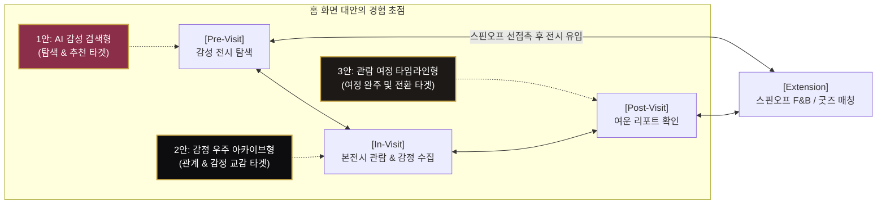
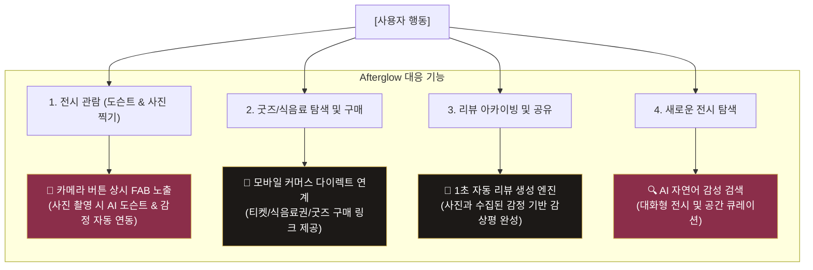
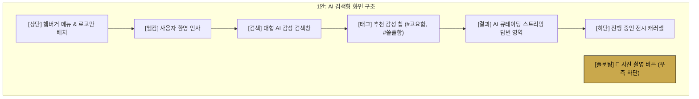
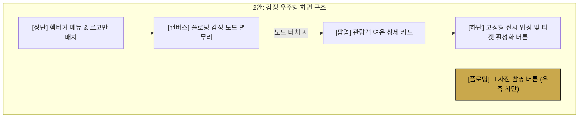
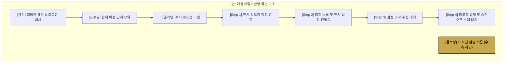

# Afterglow 홈 화면 기획 대안 제안서

본 제안서는 전시 관람의 여운을 확장하는 **Afterglow** 서비스의 컨셉을 가장 잘 드러내기 위해, 기존 포털형 레이아웃을 대체할 **3가지 홈 화면 대안 레이아웃**의 상세 사양과 기대 효과를 정리한 문서입니다.

---

## 🚦 1. 전체 여정 & 홈 컨셉 순환 도식화

전시 관람객의 경험 흐름은 순방향(`본전시 -> 스핀오프`)뿐만 아니라, 오프라인 F&B나 굿즈 스토어를 먼저 발견하고 전시로 이어지는 역방향(`스핀오프 -> 본전시`)의 순환 구조를 가집니다. 3가지 대안 홈 컨셉은 이 유기적인 여정의 핵심 연결고리 역할을 수행합니다.

---

## 🛠️ 2. 핵심 사용자 행동 기반 Afterglow 서비스 맵

Afterglow는 관람객이 전시 공간과 전시 전후에서 경험하는 4가지 상위 행동을 기반으로 설계되었습니다.

---

## 🌌 3. 3가지 대안 레이아웃 비교 및 시안

> [!IMPORTANT]
> **3가지 대안 공통 규칙 (UI/UX 쇄신)**
> 1. **하단 네비게이션 바 완전 제거**: 복잡하고 분산된 탭바를 지우고, **좌측 상단의 햄버거 메뉴(Menu Drawer)**를 통해서만 네비게이션이 동작하게 통일하여 콘텐츠 몰입을 높였습니다.
> 2. **📸 사진 촬영 플로팅 버튼(FAB) 상시 배치**: 관람객이 전시장에서 가장 직관적으로 취하는 행동인 '사진 찍기'를 홈 화면 우측 하단에 고정 노출하여, 클릭 즉시 카메라 진입 및 AI 감정 연동이 가능하도록 설계했습니다.

---

## 1안) AI 감성 큐레이터 검색형 (Perplexity / ChatGPT 스타일)

> **"사용자의 마음에 인공지능이 작품과 코스로 답하다."**

### 📱 UI 목업 디자인 시안

### 🎨 레이아웃 구조도

### 📝 상세 작동 시나리오
1. **첫 진입**: 상단 좌측 햄버거 메뉴와 로고가 나타나며, 중앙에 둥글고 큼직한 검색창과 추천 감정 태그 칩이 시선을 사로잡습니다.
2. **AI 전시검색**: 사용자가 검색창에 *"쓸쓸하면서도 포근한 여운이 필요해"*라고 입력하면, 아래로 Perplexity 스타일의 AI 답변이 생성됩니다. 추천 전시와 그에 부합하는 작품, 주변 스핀오프 카페 코스가 하나의 스토리라인으로 큐레이션됩니다.
3. **사진 찍기 연동**: 관람객이 우측 하단의 카메라 플로팅 버튼을 눌러 스냅샷을 찍으면, 사진은 퇴장 시 생성될 '여운 리포트' 및 '자동 감상평'에 즉시 수집됩니다.

---

## 2안) 감정 우주 아카이브형 (감정 별무리 비주얼)

> **"다른 이들이 남겨놓은 여운의 우주를 유영하다."**

### 📱 UI 목업 디자인 시안

### 🎨 레이아웃 구조도

### 📝 상세 작동 시나리오
1. **첫 진입**: 다크한 배경 위에 관람객들이 수집한 감정어들(예: `#고요함`, `#몽환적`, `#경외감`)이 별빛처럼 은은하게 흔들리며 떠다닙니다.
2. **인터랙션**: 
   * 사용자가 `#몽환적` 노드를 터치하면, 해당 감정을 남긴 다른 관람객의 스냅샷 이미지와 닉네임, 그리고 그 사람이 남긴 한 줄 평이 영롱하게 팝업으로 나타납니다.
   * *팝업 예시: "@사색의별 - 물러나는 해안선에서 어스름 속 빛을 보았습니다. (스냅컷 이미지 포함)"*
3. **목적성 행동**: 화면 하단에 플로팅된 고급스러운 골드 그라디언트 버튼(`전시 입장하기` 혹은 `티켓 등록`)을 통해 본전시 가이드 모드로 쉽게 진입할 수 있도록 균형을 맞춥니다.

---

## 3안) 관람 여정 타임라인형 (Journey 지도)

> **"전시 관람의 시작부터 끝까지, 나만의 여정을 직관적으로 가이드받다."**

### 📱 UI 목업 디자인 시안

### 🎨 레이아웃 구조도

### 📝 상세 작동 시나리오
1. **첫 진입**: 포털 느낌 대신, 사용자의 관람 진행 상태가 한눈에 보이는 지하철 노선도 형태의 감각적인 타임라인 로드맵이 그려집니다.
2. **개인화 가이드 (State-driven)**:
   * **티켓 미소지자**: `Step 1. 맛보기 청취`가 완료 상태로 불빛이 들어와 있고, `Step 2. 티켓 등록` 칸에 반짝이는 하이라이트(CTA)가 표시되어 직관적으로 등록을 유도합니다.
   * **티켓 소지자(관람 중)**: `Step 3. 감정 수집` 단계가 진행 중으로 변경되며, 현재 몇 개의 감정이 쌓였는지 요약 정보를 실시간으로 보여줍니다.
   * **관람 완료자**: `Step 4. 여운 리포트 확인` 및 `스핀오프 초대장 열기` 버튼이 강조되어 활성화됩니다.
