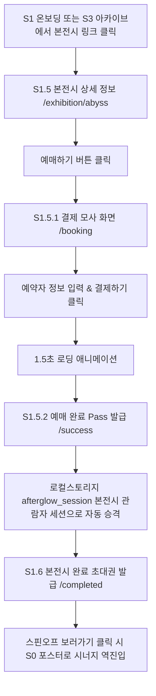

# S1.5. 본전시 상세, 예매 및 초대권 상세기획서 v0.1

> 작성일: 2026.07.29 | 상태: 📋 정식 확정 (화면별 분리)
> 포함 화면: S1.5 (상세), S1.5.1 (예매/결제 모사), S1.5.2 (예매완료 Pass), S1.6 (본전시 완료 초대권)
> 연관 문서: `docs/02_디자인/스핀오프-유저뷰-디자인가이드라인-v0.1.md`

---

## 1. 화면 개요

* **화면 ID**: `S1.5` / `S1.5.1` / `S1.5.2` / `S1.6`
* **라우팅 경로**:
  * S1.5 상세: `/exhibition/[slug]` (예: `/exhibition/abyss`)
  * S1.5.1 예매/결제: `/exhibition/[slug]/booking`
  * S1.5.2 예매완료 Pass: `/exhibition/[slug]/success`
  * S1.6 본전시 완료 초대권: `/exhibition/[slug]/completed`
* **역할**: 본전시 미관람 유저가 스핀오프 경험 전후로 원작 본전시 정보를 탐색하고, 예매 결제 모사를 통해 실제 티켓을 발급받아 본전시 관람자 세션 상태로 전이시키는 역이동 시너지 레이어.
* **디자인 테마**: 본전시 버건디 테마 (`theme: "main"`, 클래식 버건디 `#8B2E4A`)

---

## 2. 화면 전용 유저 Flow



---

## 3. 화면 전용 IA & 데이터 상태

### 3-1. IA 노드 및 데이터 구조
```
S1.5. 본전시 전용 레이어 (/exhibition/[slug])
├── S1.5 상세 정보 (/exhibition/abyss)
│   ├── 상단 네비게이션 (뒤로가기 -> 이전 스핀오프 단계)
│   ├── 히어로 비주얼 배너 (버건디 포스터)
│   ├── 본전시 정보 (타이틀 "빛의 심연", 장소, 상영 시간)
│   └── [본전시 예매하기] CTA
├── S1.5.1 예매 및 결제 모사 (/booking)
│   ├── 예약자 정보 입력 (이름, 이메일, 연락처)
│   ├── 티켓 수량 선택 (일반 15,000원, 1~5매)
│   └── [가상 결제하기] CTA
├── S1.5.2 예매 완료 Pass (/success)
│   ├── 완료 애니메이션 및 모바일 바코드/Pass 발급
│   └── [본전시 작품목록 보기] / [스핀오프 초대장 보기] CTA
└── S1.6 본전시 완료 초대권 (/completed)
    ├── 스핀오프 특별 초대 Pass 카카오/글로우 모션
    └── [스핀오프 특별 전시 보러가기 ↗] CTA
```

### 3-2. 로컬 스토리지 & 세션 상태
* **읽기**: `afterglow_session`
* **쓰기 (S1.5.2 예매 완료 시점)**:
  * 본전시 세션 자동 발급:
    ```json
    {
      "ticket_id": "TKT-20260729-8821",
      "user_name": "홍길동",
      "status": "VALIDATED",
      "purchased_at": 1785241200000
    }
    ```

---

## 4. UI/UX 요소 및 인터랙션 상세

### 4-1. 본전시 히어로 헤더 (Burgundy Hero)
* 메인 키 컬러: 버건디 (`#8B2E4A`).
* 배너 이미지: 몰입형 미디어아트 비주얼 및 "원작 본전시" 브랜딩 뱃지.

### 4-2. 가상 결제 인터랙션 (Mock Payment)
* 결제하기 클릭 시 1.5초간 시안/버건디 혼합 스피너 및 `"티켓 및 스핀오프 초대권을 생성 중입니다..."` 안내문구 노출 후 자동 전환.

### 4-3. 모바일 Pass 카드 UI (Mobile Pass Card)
* 실물 티켓을 모사한 세로형 모바일 티켓 카드 (티켓 고유 번호, 바코드 일러스트, 사용 가능 상태 활성화 뱃지).

---

## 5. 예외 및 에지케이스 처리

* **이전 스핀오프 단계 정보 누락 시**: 브라우저 뒤로가기 클릭 시 스핀오프 발견 포스터(`/spinoff/abyss-wave`)로 안전 복귀.
* **이메일/연락처 입력 오류 시**: 폼 밸리데이션 통과 전까지 결제 버튼 비활성화.
