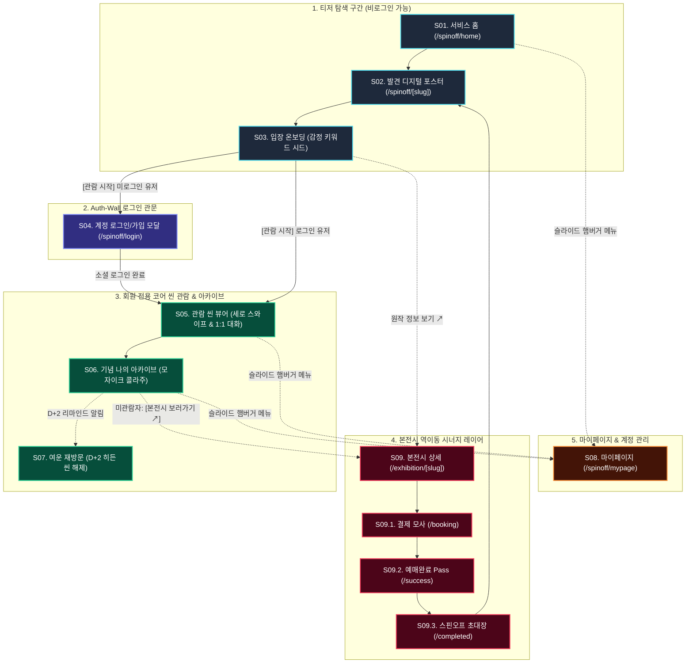
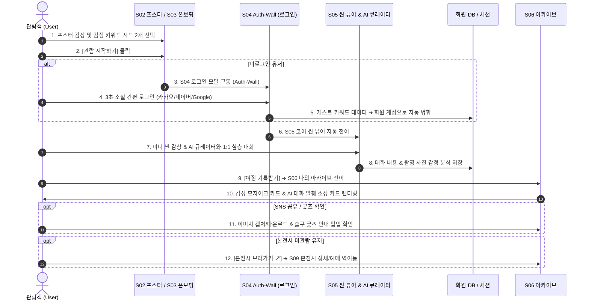

# 스핀오프 유저뷰 화면 플로우 & 시각화 정의서 v1.1

> 작성일: 2026.07.29 | 상태: 📋 정식 확정 (직관적 S01~S09 순차 넘버링 체계 적용)
> 근거: 방향성재정의 v4.0 draft, 스핀오프 유저뷰 IA v1.1, 공통 네비게이션 명세서 v0.1

---

## 1. 스핀오프 화면 플로우 종합 다이어그램 (Total Flow Diagram)

---

## 2. 유저 경험 궤적 시퀀스 다이어그램 (Experience Sequence)

---

## 3. 서사적 단계별 주요 가치 명세

1. **발견 & 입장 (S01, S02, S03)**: 무장벽(Zero-Barrier) 진입으로 부담을 지우고 감정 선택만으로 세계관에 즉시 몰입.
2. **인증 & 코어 관람 (S04, S05)**: 3초 소셜 로그인으로 회원 리드를 확보한 후, 끊김 없는 AI 1:1 대화로 세계관 경험 제공.
3. **기념 & 시너지 (S06, S09)**: 나의 감정 모자이크 소장 카드 발급 및 본전시 예매 시너지 역이동 완성.
4. **여운 (S07, S08)**: D+2 리마인드 및 마이페이지 아카이브 갤러리에서 지속적인 관람 여운 유지.
