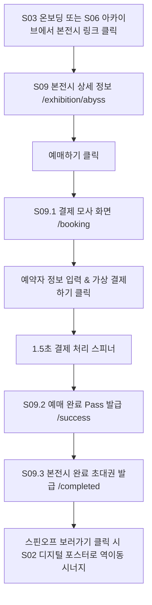

# S09. 본전시 상세, 예매 및 초대권 상세기획서 v0.1

> 작성일: 2026.07.29 | 상태: 📋 정식 확정 (직관적 S01~S09 넘버링 개편)
> 포함 화면: S09 상세, S09.1 예매/결제 모사, S09.2 예매완료 Pass, S09.3 본전시 완료 초대권
> 연관 문서: `docs/02_디자인-시스템/스핀오프-유저뷰-디자인가이드라인-v0.1.md`

---

## 1. 화면 개요

* **화면 ID**: `S09` (S09.1, S09.2, S09.3 포함)
* **라우팅 경로**:
  * S09 상세: `/exhibition/[slug]` (예: `/exhibition/abyss`)
  * S09.1 예매/결제: `/exhibition/[slug]/booking`
  * S09.2 예매완료 Pass: `/exhibition/[slug]/success`
  * S09.3 본전시 완료 초대권: `/exhibition/[slug]/completed`
* **역할**: 유저 여정 9단계. 본전시 미관람 유저가 스핀오프 경험 전후로 원작 본전시 정보를 탐색하고, 예매 결제 모사를 통해 실제 티켓을 발급받아 본전시 관람자 세션 상태로 전이시키는 역이동 레이어.
* **디자인 테마**: 본전시 버건디 테마 (`theme: "main"`, 클래식 버건디 `#8B2E4A`)

---

## 2. 서비스 정책 (Policies)

* **2-1. 본전시 관람권 발급 및 세션 승격 정책**:
  * 결제 완료(S09.2) 시 해당 유저 회원 계정에 티켓 Pass가 즉시 저장되고 `seen_main_exhibition = true` 세션으로 자동 승격됨.
* **2-2. 예매 시 로그인 필수 정책**: 본전시 가상 결제 진행 시 로그인 유저 계정이 기본 지정됨.

---

## 3. 화면 전용 유저 Flow



---

## 4. 화면 전용 IA & 기능 정의 (Function Specs)

### 4-1. IA 노드 구조
```
S09. 본전시 전용 레이어 (/exhibition/[slug])
├── S09 상세 정보 -> 뒤로가기, 히어로 배너, 전시 개요, [예매하기] CTA
├── S09.1 예매 결제 모사 -> 예약자 폼, 매수 선택(1~5매), [가상 결제하기]
├── S09.2 예매 완료 Pass -> 바코드 Pass 카드, [스핀오프 초대장 보기]
└── S09.3 본전시 완료 초대권 -> 스핀오프 특별 초대장, [스핀오프 보러가기 ↗] (S02 이동)
```

### 4-2. 주요 기능 명세
| 기능 ID | 기능명 | 동작 명세 | 비고 |
|---|---|---|---|
| `FN-S09-01` | 예매하기 클릭 | S09.1 결제 입력 화면(`/booking`)으로 이동 | 예매 진입 |
| `FN-S09-02` | 가상 결제하기 | 1.5초 로딩 스피너 구동 후 티켓 생성 및 S09.2 전환 | 모사 결제 |
| `FN-S09-03` | 초대권 전이 클릭 | 클릭 시 S02 디지털 포스터 페이지(`/spinoff/abyss-wave`)로 역진입 | 시너지 |

---

## 5. UI/UX 인터랙션 및 에지케이스

* **결제 애니메이션**: 버건디 그라디언트 펄스 스피너 연출.
* **에지케이스**: 수량 미선택 시 결제 버튼 비활성.
