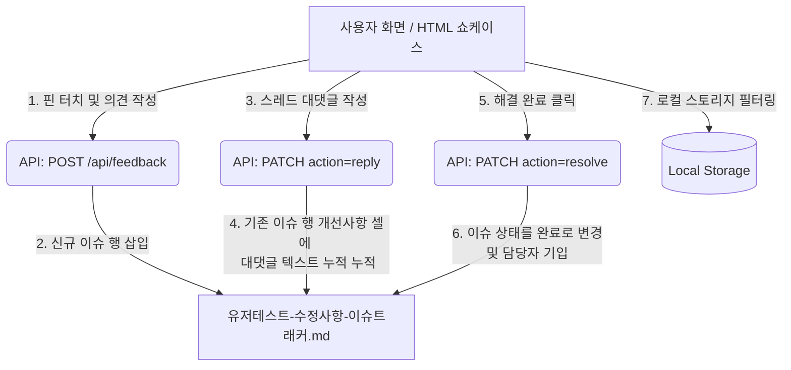

# 📍 실시간 화면 피드백 동기화 시스템 명세서
(Real-time Overlay Feedback & Markdown Syncer Spec)

본 문서는 기획서(HTML 쇼케이스) 및 개발 중인 유저뷰 화면상에서 **의견 핀(✦)을 직접 꽂고, 릴레이 대댓글(Reply)을 달아 토론하며, 해결 시 핀을 지우는 실시간 QA 협업 시스템**의 데이터 모델과 동기화 프로토콜을 정의합니다.

이 규격을 준수함으로써, 지라(Jira) 등 별도의 이슈 툴 없이도 화면 안에서 즉각적으로 QA 피드백 환류 루프를 구현할 수 있습니다.

---

## 1. 🏗️ 시스템 아키텍처 및 동기화 흐름

피드백 시스템은 화면에 표시되는 **피드백 핀 오버레이(프론트엔드)**, 좌표 및 스레드 데이터를 해석하여 마크다운 문서로 갱신해주는 **동기화 API(백엔드)**, 그리고 최종 진실의 원천(SSOT)이 되는 **이슈 트래커 파일(마크다운)**로 구성됩니다.



---

## 2. 📄 데이터 계약 및 계약 모델 (Data Contract)

### 2.1. 피드백 핀 모델 (`FeedbackPin`)
각 피드백 핀은 화면의 상대적 좌표(가로/세로 백분율)를 기준으로 정렬되어 브라우저 크기 변화에 대응합니다.

```typescript
interface FeedbackPin {
  id: string;        // 이슈 ID (서버 연동 시 #001 형태, 로컬 임시용은 CRW-Date)
  page: string;      // 피드백이 등록된 브라우저 pathname (예: "/home")
  xRatio: number;    // 중앙 정렬 컨테이너 기준 가로 비율 (%)
  yRatio: number;    // 중앙 정렬 컨테이너 기준 세로 비율 (%)
  comment: string;   // 피드백 원본 내용
  nickname: string;  // 작성자 이름 (기본값: "크루")
  replies?: Reply[]; // 해당 핀에 누적된 대댓글 스레드 배열
}
```

### 2.2. 대댓글 모델 (`Reply`)
해결되지 않은 피드백 핀을 두고 크루원들이 덧붙인 토론 정보입니다.

```typescript
interface Reply {
  id: string;        // 대댓글 고유 ID
  nickname: string;  // 대댓글 작성자 (예: "크루")
  comment: string;   // 대댓글 텍스트 내용
  date: string;      // 등록 날짜 (MM/DD)
}
```

---

## 3. 🌐 API 엔드포인트 규격 (Next.js 라우터 프로토콜)

엔드포인트 주소: `POST/PATCH /api/feedback`

### 3.1. 피드백 핀 신규 등록 (`POST`)
화면에 터치(클릭)하여 새 핀을 꽂고 의견을 제출할 때 호출합니다.

* **Request Body**:
  ```json
  {
    "comment": "검색창 테두리가 너무 얇은 것 같습니다.",
    "page": "/home",
    "xRatio": 87.2,
    "yRatio": 68.1,
    "nickname": "크루"
  }
  ```
* **백엔드 처리 로직**:
  1. `유저테스트-수정사항-이슈트래커.md` 파일을 로드합니다.
  2. 기존 테이블에서 최댓값 ID(예: `#014`)를 읽어와 다음 번호인 `#015`를 자동 발급합니다.
  3. 마크다운 테이블 내 데이터 행들의 가장 아랫단(템플릿 가이드 바로 위)을 찾아 새 테이블 행을 동적으로 삽입합니다.
     - 삽입 템플릿: `| **#015** | 07/11 | /home | {comment} (위치: X {xRatio}%, Y {yRatio}%) | **P2** | **📋 대기** | - | 화면 직접 등록 피드백 (작성자: {nickname}) |`
  4. 갱신된 파일 내용을 동기적으로 `fs.writeFileSync` 합니다.

---

### 3.2. 피드백 대댓글 등록 (`PATCH` - action: "reply")
이미 꽂혀 있는 특정 핀 카드에 대댓글(Reply)을 등록하여 누적 대화를 나눌 때 호출합니다.

* **Request Body**:
  ```json
  {
    "id": "#015",
    "action": "reply",
    "replyComment": "동감합니다. 버건디 포인트를 테두리에도 1px 얹으면 좋겠네요.",
    "nickname": "기획자"
  }
  ```
* **백엔드 처리 로직**:
  1. 마크다운 파일에서 `**#015**`가 포함된 테이블 행(Row)을 찾아냅니다.
  2. 해당 행을 파이프(`|`) 기준으로 분할하여 5번째 항목인 **발견된 문제 및 개선사항** 컬럼 데이터를 확보합니다.
  3. 기존 텍스트 뒤에 HTML 줄바꿈 태그(`<br>`)와 함께 대댓글 정보를 누적 기입합니다.
     - 추가 형식: `<br> └ *{nickname} ({MM/DD}): {replyComment}*`
  4. 재결합한 테이블 행으로 파일을 갱신합니다.

---

### 3.3. 피드백 완료(해결) 처리 (`PATCH` - action: "resolve")
화면에서 변경 사항을 눈으로 확인한 검토자가 해결 버튼을 눌러 핀을 완전히 없앨 때 호출합니다.

* **Request Body**:
  ```json
  {
    "id": "#015",
    "action": "resolve"
  }
  ```
* **백엔드 처리 로직**:
  1. 마크다운 파일에서 `**#015**`가 포함된 행을 찾아냅니다.
  2. 해당 행의 상태 정보 컬럼에 들어 있는 `📋 대기` 또는 `⚙️ 진행 중` 문자열을 **`✅ 완료`**로 치환합니다.
  3. 비어있는 담당자(`-`)란이 감지되면 자동으로 `Antigravity` 또는 지정 담당자로 기입합니다.
  4. 파일 내용을 안전하게 업데이트합니다.

---

## 4. 🛠️ 플랫폼별 이식 및 구현 가이드

### 4.1. 정적 HTML 쇼케이스(기획안) 이식 방법
정적 HTML 문서에서 핀 오버레이 및 덧글 렌더링을 구현할 때는 아래의 자바스크립트 컴포넌트 핵심 로직을 탑재합니다.

```javascript
// 핀 해결 처리 클라이언트 로직 예시
async function resolveWidePin(id) {
  try {
    await fetch("http://localhost:5177/api/feedback", {
      method: "PATCH",
      headers: { "Content-Type": "application/json" },
      body: JSON.stringify({ id, action: "resolve" })
    });
  } catch (err) {
    console.warn("오프라인 상태: 로컬 스토리지에서만 제거합니다.");
  }
  
  // 로컬 브라우저 세션 스토리지에서 제거하여 화면 갱신
  let feedbacks = JSON.parse(localStorage.getItem("afterglow_page_feedbacks") || "[]");
  feedbacks = feedbacks.filter(f => f.id !== id);
  localStorage.setItem("afterglow_page_feedbacks", JSON.stringify(feedbacks));
  renderWidePins(); // 핀 다시 그리기
}
```

### 4.2. Next.js/React 공통 셸 이식 방법
React 환경에서는 공통 셸 컴포넌트(예: `NavigationShell.tsx`) 내에 피드백 상태(`localPins`)를 선언하고, `main` 컨테이너의 상대 좌표계를 활용해 절대 좌표 핀을 뿌려 줍니다.

* **정렬 정밀도 팁**: 핀을 화면 전체(`window`) 기준으로 그리면 브라우저 창 크기를 늘이고 줄일 때 핀의 꽂힌 위치가 어긋납니다. 반드시 **가로 폭이 고정된 중앙 정렬 레이아웃 컨테이너(`ref={containerRef}`)**를 기준으로 마우스 상대 좌표(`clientX - left`) 비율을 계산하여 좌표 꼬임을 방지하십시오.
